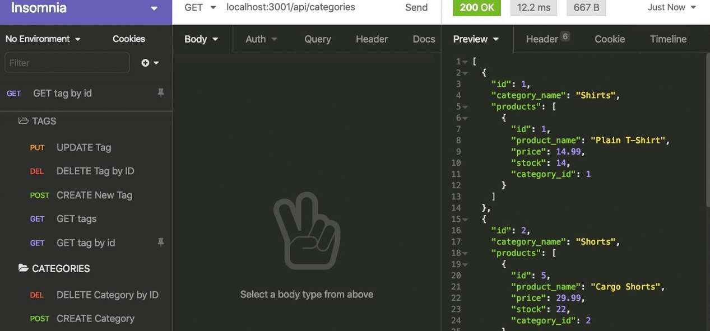
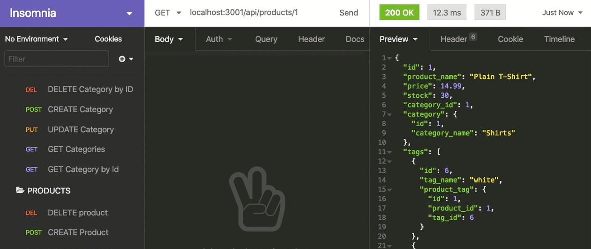

## Object-Relational Mapping (ORM) E-Commerce Back End

- [Live Demo](https://drive.google.com/file/d/1EF2ruLfLVADquC9gUSsbWieEUHMKMo-v/view)

- 
- 
- 

## Contents

[Description](#description)

[Installation](#installation)

[Usage](#usage)

[Resources & Credit](#resourcescredit)

[Features](#features)

[Application Screenshot Preview](#application-screenshot-preview)

## Description

- Internet retail, also known as e-commerce, is the largest sector of the electronics industry, having generated an estimated US$29 trillion in 2017 (Source: United Nations Conference on Trade and Development). E-commerce platforms like Shopify and WooCommerce provide a suite of services to businesses of all sizes. Due to the prevalence of these platforms, developers should understand the fundamental architecture of e-commerce sites.

- My task is to build the back end for an e-commerce site. I will be using Express.js API and configure it to use Sequelize to interact with a MySQL database.

## Installation

1. Cloning the Repository

- First, clone the repository containing the functional Express.js API:

```
git clone <repository-url>
cd <repository-folder>
```

2. Setting up Environment Variables

- Create a .env file in the root of the project folder and add your MySQL database credentials:

```
DB_NAME=<your-database-name>
DB_USER=<your-mysql-username>
DB_PASSWORD=<your-mysql-password>
```

- This will enable you to connect to the database using Sequelize.

## Usage

1. Creating and Seeding the Development Database

- Install the required dependencies:

```
npm install
```

2. Run the schema and seed commands & start the server with:

```
npm run seed
npm start
```

3. Testing API GET Routes

- Open API GET routes in Insomnia (or any API client of your choice) for categories, products, or tags:

```
GET http://localhost:3001/api/categories
GET http://localhost:3001/api/products
GET http://localhost:3001/api/tags

```

- The data for each of these routes will be displayed in a formatted JSON.

4. Testing API POST, PUT, and DELETE Routes:

- Test API POST, PUT, and DELETE routes in Insomnia to create, update, and delete data in your database:

- Categories

```
POST http://localhost:3001/api/categories
PUT http://localhost:3001/api/categories/:id
DELETE http://localhost:3001/api/categories/:id

```

- Products

```
POST http://localhost:3001/api/products
PUT http://localhost:3001/api/products/:id
DELETE http://localhost:3001/api/products/:id

```

- Tags

```
POST http://localhost:3001/api/tags
PUT http://localhost:3001/api/tags/:id
DELETE http://localhost:3001/api/tags/:id

```

## Resources/Credit

- Starter Code Provided by UM Bootcamp
- Author: Martin Cespedes - [Link to my Github](https://github.com/MartinCespedes)

## Features

- Express.js
- MySQL
- Sequelize
- JavaScript

## Application Screenshot Preview (Insomnia)



##



## License


Copyright (c) 2023 Martin Cespedes. All rights reserved.
